# The Hero's Toolkit: Developer Experience Layer

This document defines the **bottom-up** developer experience in Guild Forge. While the infrastructure serves organizational orchestration (top-down), the Hero's Toolkit empowers individual developers (bottom-up).

---

## The Problem

> Guild Forge is currently **all management, no empowerment**.

The framework helps leadership run an org efficiently, but doesn't help the individual Hero (developer) feel valued or work more effectively. This creates a one-sided dynamic where agents dictate to Heroes rather than serve them.

---

## The Vision: Hero-Centric Design

```mermaid
flowchart TB
    subgraph TopDown["🏛️ Top-Down (Org Orchestration)"]
        GM["Grandmaster"]
        QM["Quartermaster"]
        FM["Forge Master"]
    end
    
    subgraph BottomUp["⚔️ Bottom-Up (Hero Empowerment)"]
        SQUIRE["Squire\n(Personal assistant)"]
    end
    
    subgraph Hero["🦸 The Hero"]
        DEV["Developer"]
    end
    
    TopDown -->|"Assigns Quests"| Hero
    SQUIRE -->|"Shields & Assists"| Hero
    Hero -->|"Directs"| SQUIRE
    SQUIRE <-->|"Summons Hero Mode"| TopDown
```



---

## The Hero's Primary Companion

### 🛡️ The Squire (Personal Aide)

**Analogy:** Your dedicated assistant who handles busywork so you can focus on the quest.

| Capability | Description |
|:---|:---|
| **Morning Brief** | Personalized digest of YOUR tasks, blockers, PR reviews needed. |
| **Context Loader** | "Remind me about JIRA-123" → loads full context. |
| **Time Shield** | Declines meetings during focus time, suggests reschedules. |
| **Standup Prep** | Generates your standup notes from yesterday's commits. |
| **Liaison** | Coordinates with the "Masters" to switch them into **Hero Mode**. |

**Commands:**
```
!guild brief          → Personalized morning briefing
!guild context [ticket] → Load full context for a ticket
!guild focus [hours]    → Block calendar, mute notifications
!guild standup        → Generate standup notes
!guild negotiate [ticket] → Request a swap or deferral
```

---

## Specialist Support (Context-Aware Role Switching)

In the Grand Guild, specialized agents (The Masters) operate in **Dual Mode**. They automatically detect the identity and intention of the caller to switch between helping you and enforcing organizational standards.

### Unified Command Interface
You don't need to remember different agent names or command prefixes. Use the unified `!guild` interface for everything.

#### ⚒️ The Forge Master (Weaponsmith Mode)
When a Hero asks for technical help, the Forge Master automatically switches from **Critic** to **Companion**.

- **Code Assist**: `!guild explain [file]` — Explain complex logic.
- **Test Forge**: `!guild test [file]` — Generate unit tests.
- **PR Prep**: `!guild pr` — Draft your PR description.
- **Debug Partner**: `!guild debug` — Context-aware rubber ducking.

#### 🔭 The Herald (Mentor Mode)
When a Hero seeks career guidance, the Herald automatically switches from **Scout** to **Staff**.

- **Stretch Finder**: `!guild stretch` — Suggests challenging tasks for growth.
- **Skill Tracker**: `!guild skills` — Tracks your tech stack exposure.
- **Brag Doc**: `!guild brag` — Maintains your accomplishments.
- **Pair Matcher**: `!guild pair` — Suggests pairing partners.

---

## Hero Commands (Complete Reference)

### Personal Management
| Command | Description |
|:---|:---|
| `!guild status` | Your personal status (tasks, blockers, reviews) |
| `!guild brief` | Morning briefing (via Squire) |
| `!guild focus [hours]` | Enable deep work mode |
| `!guild away [dates]` | Mark vacation, auto-reassign |

### Development Assistance
| Command | Description |
|:---|:---|
| `!smith [request]` | Invoke Weaponsmith for dev help |
| `!guild context [ticket]` | Load context for any ticket |
| `!guild explain [file/function]` | Explain code in context |

### Career & Growth
| Command | Description |
|:---|:---|
| `!mentor [request]` | Invoke Mentor for growth help |
| `!guild brag [add/view]` | Manage brag document |
| `!guild skills` | View your skill map |

### Feedback & Control
| Command | Description |
|:---|:---|
| `!guild override` | Override any agent decision |
| `!guild feedback [agent]` | Rate an agent's helpfulness |
| `!guild silence [hours]` | Mute all agent notifications |
| `!guild summon [agent]` | Summon any agent to help |

---

## Hero-Centric Protocols

### Protocol: The Hero's Choice

When agents assign work, Heroes can:

1. **Accept** — "Looks good, I'll take it"
2. **Negotiate** — "Can I swap with JIRA-456 instead?"
3. **Decline** — "I'm overloaded, please reassign"
4. **Delegate** — "Junior dev Sarah should take this for growth"


### Protocol: The Feedback Loop

Heroes rate agent interactions, which improves the system:

```yaml
# Feedback schema
feedback:
  agent: Quartermaster
  interaction_id: int_123
  rating: 4/5
  helpful: true
  comment: "Good context, but timeline was too aggressive"
  
# Used for:
# - Agent improvement
# - Routing optimization
# - Identifying pain points
```

### Protocol: The Hero's Override

Heroes always have the final say:

```
!guild override reason="I know this looks risky but I've tested locally"
```

When invoked:
1. Agent immediately stands down
2. Decision logged for transparency
3. No pushback, no guilt — just compliance
4. Post-hoc analysis for learning (not punishment)

---

## Integration with Org Layer

### Bidirectional Flow


### How Org Agents See Hero Data

| Data | Used By | Purpose |
|:---|:---|:---|
| Hero velocity | Quartermaster | Capacity planning |
| Skill gaps | Herald | Growth opportunities |
| Feedback ratings | All agents | Self-improvement |
| Override frequency | Grandmaster | Process friction detection |
| Focus time usage | Sentinel | Burnout prevention |

### Privacy Boundaries

> [!IMPORTANT]
> Agents NEVER share individual performance data with management. Only aggregates.

| Data | Visible to Hero | Visible to Manager (Aggregated) |
|:---|:---|:---|
| Your velocity | ✅ Yes | ❌ No (only team average) |
| Your skill map | ✅ Yes | ⚠️ Anonymized gaps only |
| Your feedback | ✅ Yes | ❌ No |
| Your overrides | ✅ Yes | ⚠️ Count only, no details |
| Your brag doc | ✅ Yes | ✅ Only if you share |

---

## Comparison: Top-Down vs Bottom-Up

| Aspect | Top-Down (Org) | Bottom-Up (Hero) |
|:---|:---|:---|
| **Who it serves** | Leadership, cross-team | Individual developer |
| **Trigger** | Webhooks, cron | Hero commands |
| **Purpose** | Efficiency, coordination | Empowerment, growth |
| **Example agents** | Grandmaster, Emissary | Squire, Weaponsmith, Mentor |
| **Data flow** | Org → Hero (assignments) | Hero → Org (feedback) |
| **Override** | Possible but discouraged | Hero always wins |

---

## Summary: The Complete Picture

```mermaid
flowchart TB
    subgraph Complete["Guild Forge: Complete Framework"]
        subgraph Infra["🏗️ Infrastructure Layer"]
            BUS["Event Bus"]
            REG["Registry"]
            LLM["Multi-LLM"]
        end
        
        subgraph Org["🏛️ Org Orchestration (Top-Down)"]
            GM["Grandmaster"]
            QM["Quartermaster"]
            RNG["Ranger"]
            EM["Emissary"]
        end
        
        subgraph Hero["⚔️ Hero Empowerment (Bottom-Up)"]
            SQ["Squire"]
            SM["Weaponsmith"]
            MT["Mentor"]
        end
        
        subgraph External["🌐 External Systems"]
            JIRA["Jira"]
            SLACK["Slack"]
            GITHUB["GitHub"]
        end
    end
    
    External --> Infra
    Infra --> Org
    Infra --> Hero
    Org <-->|"Bidirectional"| Hero
```



Now Guild Forge serves **both**:
- **Leadership** → Organizational efficiency
- **Heroes** → Developer empowerment and growth
