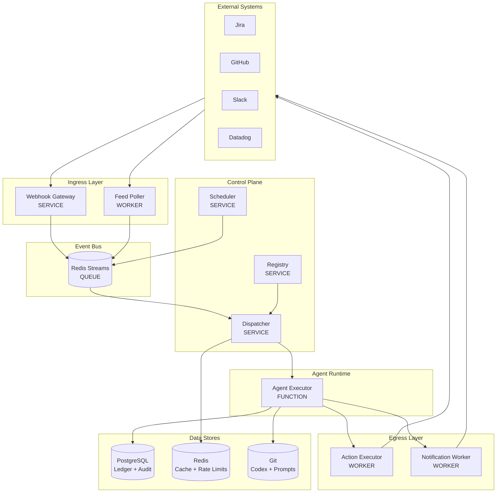

# The Citadel: Infrastructure Architecture

This document defines the **Infrastructure Layer** of the Grand Guild — the foundational machinery that allows agents to be spawned, scheduled, discovered, and governed. Think of this as the **Operating System** or **Kubernetes-for-Agents** that underlies all Guild operations.

---

## Component Taxonomy

Before diving in, understand what each term means:

| Term | What It Is | Example |
|:---|:---|:---|
| **Service** | A long-running process/container that handles requests | Webhook Gateway, Registry |
| **Worker** | Background process consuming from queues | Feed Poller, Notification Sender |
| **Function** | Serverless/ephemeral compute triggered by events | Agent Executor |
| **Queue** | Message broker for async communication | Redis Streams, Kafka |
| **Store** | Persistent data storage | PostgreSQL (Ledger), Redis (Cache) |
| **Agent** | AI model invocation with prompt + context | The Quartermaster, The Ranger |

> [!IMPORTANT]
> **Agents are NOT services.** An Agent is a *logical persona* that runs as a *Function* invocation. The "Quartermaster" isn't a running container — it's a prompt template + context loaded into an LLM when triggered.

---

## Architecture Overview

---

## The Agentic Paradigm Shift

Traditional container orchestration (Kubernetes) manages resources based on **CPU/Memory**. The Guild manages resources based on **Token consumption**.

| Kubernetes Concept | Guild Equivalent | Description |
|:---|:---|:---|
| Pod | Agent Invocation | A single agent execution |
| CPU/Memory Limits | Token Budget | Per-invocation and per-period limits |
| Deployment | Agent Manifest | YAML config for agent behavior |
| Service Discovery | Registry | Finding and health-checking agents |
| Resource Quotas | Mana Pool | Organization-wide token budgets |

---

## Documentation

| Document | Description |
|:---|:---|
| [**Systems Architecture**](./systems_architecture.md) | **Start here.** Concrete specifications for every component — what it is, how it's built, database schemas, deployment options. |
| [**Enhanced Capabilities**](./enhanced_capabilities.md) | **NEW.** Swarm execution, Q-learning routing, multi-LLM support, shared memory. |
| [Orchestration](./orchestration.md) | Conceptual model for agent lifecycle, scheduling, discovery, and resource governance |
| [I/O Fabric](./io_fabric.md) | Conceptual model for ingress/egress and external system integration |

---

## Infrastructure Components Summary

### Services (Always Running)

| Service | Purpose |
|:---|:---|
| **Webhook Gateway** | Receives webhooks from Jira, GitHub, Slack; validates and publishes to Event Bus |
| **Dispatcher** | Routes events to correct agents; applies priority, rate limiting, debouncing |
| **Scheduler** | Cron engine for time-based triggers |
| **Registry** | Stores agent manifests; provides discovery API; tracks health |

### Workers (Background Processes)

| Worker | Purpose |
|:---|:---|
| **Feed Poller** | Periodically fetches from RSS, APIs, email inboxes |
| **Action Executor** | Executes side-effects (Jira writes, GitHub comments) with retry logic |
| **Notification Worker** | Sends Slack/Teams/Email with throttling and digest aggregation |

### Functions (Ephemeral Compute)

| Function | Purpose |
|:---|:---|
| **Agent Executor** | Loads prompt, fetches context, calls LLM, executes tool calls |

### Data Stores

| Store | Technology | Purpose |
|:---|:---|:---|
| **Ledger** | PostgreSQL | Token budgets, usage tracking, audit log |
| **Cache** | Redis | Rate limiting, debouncing, session state |
| **Codex** | Git | Prompts, agent manifests, policies, ADRs |
| **Artifacts** | S3/GCS | Large files, reports, backups |

### Event Bus (Queue)

| Technology | Purpose |
|:---|:---|
| Redis Streams / Kafka / SQS | All async communication between components |
