# Enhanced Capabilities: Agent Intelligence Layer

This document extends the Guild Forge infrastructure with advanced capabilities inspired by claude-flow and other multi-agent orchestration systems. These features close the gap between Guild Forge's organizational focus and the sophisticated agent execution capabilities of development-focused tools.

---

## 1. Swarm Execution (Agent Coordination)

### Overview

Beyond single-agent invocations, Guild Forge supports **swarm execution** — multiple agents working together on complex tasks with coordination and shared context.

```mermaid
flowchart TB
    subgraph SwarmTypes["Swarm Topologies"]
        HIER["🏰 Hierarchical\n(Queen + Workers)"]
        MESH["🕸️ Mesh\n(Peer-to-Peer)"]
        PIPE["⛓️ Pipeline\n(Sequential)"]
        CONS["🗳️ Consensus\n(Voting)"]
    end
```



### Swarm Topologies

| Topology | Use Case | Example |
|:---|:---|:---|
| **Hierarchical** | Complex tasks requiring oversight | Grandmaster → Quartermaster → Sentinel |
| **Mesh** | Collaborative analysis | Multiple Scouts analyzing different data sources |
| **Pipeline** | Sequential processing | Ranger → Investigator → Scribe (incident flow) |
| **Consensus** | Decision requiring multiple perspectives | Sage + Forge Master voting on architecture |

### Swarm Configuration

```yaml
# guild/swarms/incident-response.yaml
apiVersion: guild/v1
kind: Swarm
metadata:
  name: incident-response
  
spec:
  topology: pipeline
  
  stages:
    - name: detection
      agent: Ranger
      triggers:
        - type: webhook
          source: datadog
          
    - name: investigation
      agent: Investigator
      receives_from: detection
      
    - name: documentation
      agent: Scribe
      receives_from: investigation
      outputs:
        - type: adr
          path: doc/incidents/
        
  coordination:
    timeout: 30m
    on_failure: escalate_to_human
    shared_context: true
```

### Swarm Execution Flow


---

## 2. Intelligent Task Routing

### Overview

Instead of static rules, Guild Forge uses **adaptive routing** that learns from outcomes to improve agent selection and task distribution.


### Routing Strategies

| Strategy | How It Works | When to Use |
|:---|:---|:---|
| **Rule-Based** | Event type → Agent mapping | Known, predictable events |
| **Q-Learning** | Learns from success/failure | High-volume, varied events |
| **Expert Ensemble** | Domain-specific classifiers | Specialized domains |
| **Load-Balanced** | Distribute across agents | Prevent agent overload |

### Q-Learning Router

```mermaid
flowchart TB
    subgraph QLearning["Q-Learning Routing Loop"]
        E["Event"] --> S["State Vector\n(event_type, source, context)"]
        S --> Q["Q-Table Lookup"]
        Q --> A["Select Agent\n(ε-greedy)"]
        A --> R["Execute + Measure"]
        R --> U["Update Q-Value\nQ(s,a) += α(reward - Q(s,a))"]
        U -.-> Q
    end
```



**State Vector:**
- Event type (TICKET_BLOCKED, PR_OPENED, INCIDENT, etc.)
- Source system (Jira, GitHub, Datadog)
- Chapter context
- Time of day / urgency
- Previous routing for similar events

**Reward Signal:**
- Task completed successfully? (+1)
- Human override required? (-0.5)
- Time to resolution (faster = higher reward)
- Token efficiency (lower cost = bonus)

### Router Configuration

```yaml
# guild/routing/config.yaml
apiVersion: guild/v1
kind: RoutingPolicy
metadata:
  name: adaptive-router

spec:
  strategy: hybrid
  
  layers:
    # Layer 1: Hard rules (always applied)
    - type: rules
      priority: 1
      rules:
        - event: RED_FLARE
          agent: Ranger
          priority: P0
          
    # Layer 2: Q-Learning (adaptive)
    - type: q_learning
      priority: 2
      config:
        learning_rate: 0.1
        discount_factor: 0.95
        exploration_rate: 0.1
        min_samples_before_learning: 100
        
    # Layer 3: Load balancing (fallback)
    - type: load_balanced
      priority: 3
      
  feedback:
    success_signal: task_completed
    failure_signal: human_override
    latency_weight: 0.2
    cost_weight: 0.1
```

### Routing Metrics Table

```sql
CREATE TABLE routing_history (
    id UUID PRIMARY KEY,
    event_id VARCHAR(100),
    event_type VARCHAR(50),
    source_system VARCHAR(50),
    selected_agent VARCHAR(100),
    routing_strategy VARCHAR(50),       -- 'rules', 'q_learning', 'load_balanced'
    selection_confidence FLOAT,
    
    -- Outcome metrics
    task_completed BOOLEAN,
    human_override BOOLEAN,
    resolution_time_seconds INTEGER,
    tokens_consumed INTEGER,
    
    -- Learning
    reward_signal FLOAT,
    q_value_before FLOAT,
    q_value_after FLOAT,
    
    timestamp TIMESTAMP
);
```

---

## 3. Multi-LLM Provider Support

### Overview

Guild Forge supports multiple LLM providers with intelligent selection based on task requirements, cost, and availability.

```mermaid
flowchart TB
    subgraph Providers["🤖 LLM Providers"]
        CLAUDE["Anthropic Claude\n(Sonnet, Opus)"]
        GPT["OpenAI GPT\n(4o, 4-turbo)"]
        GEMINI["Google Gemini\n(Pro, Ultra)"]
        LOCAL["Local Models\n(Ollama, vLLM)"]
    end
    
    ROUTER["Model Router"] --> Providers
    
    subgraph Selection["Selection Criteria"]
        COST["💰 Cost"]
        QUAL["⭐ Quality"]
        SPEED["⚡ Latency"]
        CAP["🎯 Capability"]
    end
    
    Selection --> ROUTER
```



### Provider Registry

```yaml
# guild/providers/llm-registry.yaml
apiVersion: guild/v1
kind: LLMRegistry
metadata:
  name: default

spec:
  providers:
    - name: claude-sonnet
      provider: anthropic
      model: claude-sonnet-4-20250514
      context_window: 200000
      cost_per_1k_input: 0.003
      cost_per_1k_output: 0.015
      capabilities: [reasoning, coding, analysis]
      priority: 1
      
    - name: claude-opus
      provider: anthropic
      model: claude-opus-4-20250514
      context_window: 200000
      cost_per_1k_input: 0.015
      cost_per_1k_output: 0.075
      capabilities: [complex_reasoning, creative, agentic]
      priority: 2
      use_for: [Sage, Grandmaster]  # High-stakes agents only
      
    - name: gpt-4o
      provider: openai
      model: gpt-4o
      context_window: 128000
      cost_per_1k_input: 0.005
      cost_per_1k_output: 0.015
      capabilities: [reasoning, coding]
      priority: 3
      
    - name: gemini-pro
      provider: google
      model: gemini-2.0-flash
      context_window: 1000000
      cost_per_1k_input: 0.00025
      cost_per_1k_output: 0.001
      capabilities: [fast, large_context]
      priority: 4
      use_for: [Scribe]  # Docs with large context
      
    - name: local-llama
      provider: ollama
      model: llama3.2:70b
      context_window: 128000
      cost_per_1k_input: 0
      cost_per_1k_output: 0
      capabilities: [basic_reasoning]
      priority: 5
      use_for: [background_tasks]

  routing:
    strategy: cost_quality_balanced
    fallback_chain: [claude-sonnet, gpt-4o, gemini-pro, local-llama]
    
  failover:
    max_retries: 3
    backoff: exponential
    on_all_fail: queue_for_later
```

### Model Selection Logic

```mermaid
flowchart TB
    START["Agent Invocation"] --> CAPS["Check Required Capabilities"]
    CAPS --> FILTER["Filter Providers by Capability"]
    FILTER --> BUDGET["Check Token Budget"]
    BUDGET --> ROUTE{"Routing Strategy?"}
    
    ROUTE -->|cost_optimized| CHEAP["Select Cheapest"]
    ROUTE -->|quality_first| BEST["Select Highest Quality"]
    ROUTE -->|balanced| SCORE["Score: quality × (1/cost)"]
    ROUTE -->|agent_specific| ASSIGN["Use Agent's Assigned Model"]
    
    CHEAP & BEST & SCORE & ASSIGN --> AVAIL{"Available?"}
    AVAIL -->|yes| INVOKE["Invoke LLM"]
    AVAIL -->|no| FALLBACK["Try Fallback Chain"]
    FALLBACK --> AVAIL
```



### Agent-to-Model Mapping

| Agent | Default Model | Reason |
|:---|:---|:---|
| **Grandmaster** | claude-opus | Complex org-wide decisions |
| **Sage** | claude-opus | Architecture reviews require deep reasoning |
| **Quartermaster** | claude-sonnet | Planning is complex but routine |
| **Sentinel** | gpt-4o | Fast code analysis |
| **Ranger** | claude-sonnet | Incident triage needs reliability |
| **Scribe** | gemini-pro | Large context for doc aggregation |
| **Background tasks** | local-llama | Zero cost for maintenance |

### Failover Flow


---

## 4. Shared Agent Memory

### Overview

For swarm coordination and learning, agents share memory through a structured memory layer.

```mermaid
flowchart TB
    subgraph Memory["🧠 Shared Memory Layer"]
        ST["Short-Term\n(Redis)\n1h TTL"]
        MT["Medium-Term\n(PostgreSQL)\n30d retention"]
        LT["Long-Term\n(Git + Vector DB)\nPermanent"]
    end
    
    AGENTS["Agents"] --> Memory
```



### Memory Types

| Type | Storage | TTL | Use Case |
|:---|:---|:---|:---|
| **Context** | Redis | 1 hour | Current task context |
| **Task** | Redis | 30 min | In-flight task state |
| **Result** | PostgreSQL | 30 days | Completed task outcomes |
| **Pattern** | Vector DB | Permanent | Learned routing patterns |
| **Knowledge** | Git | Permanent | ADRs, docs, decisions |

### Memory Schema

```sql
-- Short-term context (Redis key patterns)
-- context:{swarm_id}:{agent_id} = JSON blob
-- task:{task_id} = JSON blob
-- result:{task_id} = JSON blob

-- Medium-term results
CREATE TABLE agent_memory (
    id UUID PRIMARY KEY,
    memory_type VARCHAR(50),        -- 'result', 'pattern', 'error'
    agent_id VARCHAR(100),
    swarm_id VARCHAR(100),
    task_id VARCHAR(100),
    
    content JSONB,
    embedding VECTOR(1536),         -- For similarity search
    
    created_at TIMESTAMP,
    expires_at TIMESTAMP,
    accessed_count INTEGER DEFAULT 0
);

-- Vector similarity index
CREATE INDEX idx_memory_embedding ON agent_memory 
    USING ivfflat (embedding vector_cosine_ops);
```

---

## 5. Updated Architecture Diagram


---

## Summary: Capabilities Comparison (Post-Enhancement)

| Capability | claude-flow | Guild Forge (Enhanced) | Notes |
|:---|:---|:---|:---|
| **Swarm Execution** | ✅ 60+ agents | ✅ Hierarchical, Mesh, Pipeline, Consensus | Parity |
| **Task Routing** | ✅ Q-Learning | ✅ Hybrid (Rules + Q-Learning + Load Balance) | Parity |
| **Multi-LLM** | ✅ Claude/GPT/Gemini/Ollama | ✅ Same + cost-aware routing | Parity |
| **Shared Memory** | ✅ AgentDB | ✅ Redis + PostgreSQL + Vector DB | Parity |
| **Learning Loop** | ✅ SONA patterns | ✅ Routing feedback + pattern storage | Parity |
| **External Webhooks** | ❌ | ✅ Jira, Slack, Datadog | 🏆 Guild Forge |
| **Token Governance** | ❌ | ✅ Mana Pool, quotas | 🏆 Guild Forge |
| **Cross-Team Coord** | ❌ | ✅ Emissary, treaties | 🏆 Guild Forge |
| **Production Ops** | ❌ | ✅ Ranger, Investigator | 🏆 Guild Forge |
