# The Gatehouse: I/O Fabric

The I/O Fabric manages all information flowing in and out of the Guild. It defines how external systems connect, how data is ingested, and how agents communicate with the outside world.

---

## Overview


---

## 1. Ingress Controllers (The Heralds at the Gate)

Ingress controllers receive information from the outside world and translate it into Guild-native events.

### A. Webhook Receivers

Direct push integrations from external systems.

| Source | Events | Target Agent(s) | Latency |
|:---|:---|:---|:---|
| **Jira** | issue.created, issue.updated, sprint.started | Quartermaster, Emissary | < 2s |
| **GitHub** | push, pull_request.opened, check_run.completed | Sentinel, Forge Master | < 2s |
| **Datadog** | alert.triggered, alert.resolved | Ranger | < 1s |
| **PagerDuty** | incident.triggered, incident.acknowledged | Ranger, Grandmaster | < 1s |
| **Slack** | message.channels, app_mention, reaction_added | Various (by mention) | < 2s |

#### Webhook Schema
```json
{
  "ingress_type": "WEBHOOK",
  "id": "wh_payments_jira",
  "source": "jira",
  "endpoint": "/webhooks/jira/payments",
  "authentication": {
    "type": "hmac_sha256",
    "secret_ref": "vault://secrets/jira-webhook-secret"
  },
  "event_mapping": [
    {
      "source_event": "jira:issue_updated",
      "conditions": {
        "fields.status.to": "Blocked"
      },
      "guild_event": "BLOCKER_DETECTED",
      "target_agent": "Emissary"
    }
  ],
  "rate_limit": {
    "requests_per_minute": 100,
    "burst": 20
  }
}
```

### B. Feed Aggregators (The Scouts)

Pull-based ingestion for external information sources.

| Feed Type | Sources | Use Case | Poll Interval |
|:---|:---|:---|:---|
| **RSS/Atom** | Tech blogs, security advisories | Knowledge updates | 1 hour |
| **API Polling** | Legacy systems without webhooks | Status sync | 5 min |
| **Email Inbox** | Support tickets, vendor comms | Issue intake | 15 min |
| **Calendar** | Google Calendar, Outlook | Meeting awareness | 30 min |

#### Feed Aggregator Schema
```yaml
# guild/ingress/security-feeds.yaml
apiVersion: guild/v1
kind: FeedAggregator
metadata:
  name: cve-monitor
  
spec:
  type: RSS
  sources:
    - url: "https://nvd.nist.gov/feeds/xml/cve/misc/nvd-rss.xml"
      name: NVD CVE Feed
    - url: "https://github.com/advisories.atom"
      name: GitHub Advisories
  
  schedule: "0 * * * *"  # Hourly
  
  processing:
    filter:
      severity: ["CRITICAL", "HIGH"]
      keywords: ["node", "react", "postgres"]
    
    action:
      type: CREATE_TICKET
      target: "SECURITY"
      notify: ["Sentinel", "Mason"]
```

### C. Conversational Ingress (The Listening Posts)

Structured ways for humans to inject information.

| Interface | Mechanism | Example |
|:---|:---|:---|
| **Slash Commands** | `!guild [command]` | `!guild summon Sage` |
| **Mentions** | `@GuildBot` in channels | `@GuildBot what's the status of AUTH-101?` |
| **Reactions** | Emoji triggers | `:bug:` on a message → create bug ticket |
| **Threads** | Reply-based context | Agent responds in thread for focus |
| **Forms** | Slack/Teams modals | Structured intake (title, desc, priority) |

---

## 2. Egress Controllers (The Messengers)

Egress controllers send information from the Guild to the external world.

### A. Messaging Bots (The Town Criers)

Direct communication channels to humans.

| Platform | Capabilities | Use Cases |
|:---|:---|:---|
| **Slack** | DMs, channels, threads, reactions | Primary communication hub |
| **Microsoft Teams** | Channels, cards, mentions | Enterprise environments |
| **Discord** | Channels, embeds | Developer communities |
| **Email** | SMTP/API | Formal notifications, digests |
| **SMS/Pager** | Twilio, PagerDuty | P0 escalations |

#### Message Routing Rules

```yaml
# guild/egress/notification-policy.yaml
apiVersion: guild/v1
kind: NotificationPolicy
metadata:
  name: default-routing

spec:
  rules:
    - name: p0-incidents
      condition:
        severity: P0
      destinations:
        - type: pagerduty
          target: on-call-rotation
        - type: slack
          channel: "#incident-war-room"
          mention: "@channel"
      
    - name: daily-digest
      condition:
        type: DAILY_RAVEN
      destinations:
        - type: slack
          channel: per-user-dm
          schedule: "08:30"
      
    - name: pr-review-needed
      condition:
        type: REVIEW_REQUEST
      destinations:
        - type: slack
          target: assignee-dm
          fallback: "#code-reviews"
```

### B. Application Integrations (The Trade Routes)

Two-way integrations with business systems.

| System | Read | Write | Use Cases |
|:---|:---|:---|:---|
| **Jira/Linear** | ✓ | ✓ | Ticket creation, status updates |
| **GitHub** | ✓ | ✓ | PR comments, labels, checks |
| **Confluence/Notion** | ✓ | ✓ | Doc generation, ADRs |
| **Google Docs** | ✓ | ✓ | RFC drafts, meeting notes |
| **Datadog** | ✓ | ✗ | Metrics/logs reading |
| **AWS/GCP** | ✓ | Limited | Cost data, resource info |

#### Integration Schema
```json
{
  "integration_id": "jira-payments",
  "system": "jira",
  "connection": {
    "base_url": "https://company.atlassian.net",
    "auth": {
      "type": "oauth2",
      "token_ref": "vault://secrets/jira-oauth"
    }
  },
  "scopes": {
    "read": ["issues", "projects", "sprints"],
    "write": ["issues", "comments"]
  },
  "assigned_agents": ["Quartermaster", "Emissary"],
  "rate_limits": {
    "requests_per_minute": 60
  }
}
```

### C. Publishers (The Chroniclers)

Broadcast mechanisms for wider distribution.

| Publisher Type | Destination | Content |
|:---|:---|:---|
| **Wiki Publisher** | Confluence, Notion | ADRs, runbooks, docs |
| **Dashboard Publisher** | Grafana, DataStudio | Metrics, reports |
| **Report Generator** | Email, Slack | Weekly summaries |
| **Artifact Publisher** | Git | Generated code, configs |

---

## 3. Connector Framework

All I/O is handled through a unified connector abstraction.

### Connector Interface

```typescript
interface GuildConnector {
  // Metadata
  id: string;
  type: 'webhook' | 'polling' | 'streaming' | 'bidirectional';
  system: string;
  
  // Lifecycle
  connect(): Promise<void>;
  disconnect(): Promise<void>;
  healthCheck(): Promise<HealthStatus>;
  
  // Operations
  receive?(event: ExternalEvent): Promise<GuildEvent>;
  send?(event: GuildEvent): Promise<ExternalResponse>;
  
  // Observability
  getMetrics(): ConnectorMetrics;
}
```

### Built-in Connectors

| Category | Connectors |
|:---|:---|
| **Project Management** | Jira, Linear, Asana, Monday |
| **Source Control** | GitHub, GitLab, Bitbucket |
| **Communication** | Slack, Teams, Discord, Email |
| **Monitoring** | Datadog, PagerDuty, Sentry, New Relic |
| **Documentation** | Confluence, Notion, Google Docs |
| **Cloud** | AWS, GCP, Azure |
| **HR/People** | Workday, BambooHR (read-only, privacy-guarded) |

### Custom Connector Template

```yaml
# guild/connectors/custom-erp.yaml
apiVersion: guild/v1
kind: Connector
metadata:
  name: legacy-erp
  
spec:
  type: polling
  system: internal-erp
  
  connection:
    base_url: "https://erp.internal.company"
    auth:
      type: api_key
      header: X-API-Key
      secret_ref: vault://secrets/erp-api-key
  
  polling:
    interval: 300s
    endpoint: /api/v1/projects/status
    
  event_mapping:
    - response_field: "projects[*].budget_status"
      condition:
        equals: "OVER"
      guild_event: BUDGET_ALERT
      target_agent: Grandmaster
```

---

## 4. Message Protocols

### Inbound Event Schema

All external events are normalized to a common format:

```json
{
  "protocol": "GUILD_INGRESS_V1",
  "id": "evt_abc123",
  "timestamp": "2025-01-24T08:30:00Z",
  "source": {
    "system": "jira",
    "connector_id": "jira-payments",
    "original_event": "issue.updated"
  },
  "guild_event": "TICKET_STATUS_CHANGED",
  "payload": {
    "ticket_id": "PAY-101",
    "from_status": "In Progress",
    "to_status": "Blocked",
    "blocker_reason": "Waiting on API from Cart team"
  },
  "routing": {
    "target_agents": ["Emissary", "Quartermaster"],
    "priority": "HIGH"
  }
}
```

### Outbound Action Schema

```json
{
  "protocol": "GUILD_EGRESS_V1",
  "id": "act_xyz789",
  "timestamp": "2025-01-24T08:31:00Z",
  "source_agent": "Emissary",
  "destination": {
    "system": "slack",
    "connector_id": "slack-main",
    "target": "#payments-team"
  },
  "action": "SEND_MESSAGE",
  "payload": {
    "text": "🚨 Blocker detected: PAY-101 is blocked by Cart team API. Initiating treaty negotiation.",
    "thread_ts": null,
    "mentions": ["@alice", "@bob"]
  },
  "audit": {
    "reason": "Cross-team blocker protocol",
    "triggered_by": "evt_abc123"
  }
}
```

---

## 5. Privacy & Security Fabric

All I/O respects the Guild's privacy architecture.

### Data Classification

| Level | Examples | Handling |
|:---|:---|:---|
| **Public** | Ticket titles, PR names | Normal processing |
| **Internal** | Code content, discussions | Transient only |
| **Sensitive** | HR data, compensation | Never accessed |
| **Restricted** | Legal, security incidents | Explicit human approval |

### Connector Security Requirements

1. **Authentication**: All connectors use OAuth2 or API keys stored in Vault
2. **Encryption**: TLS 1.3 for all connections
3. **Audit Trail**: Every egress action logged with source agent and reason
4. **Rate Limiting**: Per-connector limits to prevent abuse
5. **Scope Minimization**: Connectors only granted necessary permissions

### Privacy Guards

```yaml
# guild/policies/privacy-guards.yaml
apiVersion: guild/v1
kind: PrivacyPolicy
metadata:
  name: default-guards

spec:
  blocked_channels:
    - pattern: "#private-*"
    - pattern: "#hr-*"
    - pattern: "#legal-*"
  
  pii_handling:
    names: hash_before_aggregate
    emails: never_store
    compensation: never_access
  
  data_retention:
    raw_messages: 0  # Never persist
    aggregated_metrics: 90d
    audit_logs: 365d
```

---

## 6. Common I/O Patterns

### Pattern A: Bug Report Intake

```mermaid
sequenceDiagram
    participant U as User
    participant S as Slack
    participant TC as Town Crier
    participant J as Jira
    
    U->>S: Reports bug in #feedback
    S->>TC: message.created event
    TC->>TC: Classify & deduplicate
    TC->>J: Create ticket (if new)
    TC->>S: Respond with ticket link
    TC->>S: React with 🎫
```



### Pattern B: Incident Escalation


### Pattern C: Cross-Team Negotiation


---

## 7. Control Plane Commands

| Command | Description |
|:---|:---|
| `!guild connectors` | List all active connectors and status |
| `!guild connector [id] status` | Health check specific connector |
| `!guild connector [id] pause` | Temporarily disable a connector |
| `!guild connector [id] resume` | Re-enable a paused connector |
| `!guild feeds` | Show feed aggregator status |
| `!guild notifications [on/off]` | Toggle notification delivery |

---

## Summary

The I/O Fabric provides:

| Component | Function | Examples |
|:---|:---|:---|
| **Webhook Receivers** | Real-time push ingestion | Jira, GitHub, Datadog |
| **Feed Aggregators** | Scheduled pull ingestion | RSS, API polling |
| **Messaging Bots** | Human communication | Slack, Teams, Email |
| **App Integrations** | System-to-system | Jira write, GitHub checks |
| **Connectors** | Unified abstraction | Pluggable adapters |
| **Privacy Guards** | Data protection | Classification, scope limits |
