# The Forge Core: Orchestration Layer

The Orchestration Layer is the engine room of the Citadel. It manages the lifecycle of every agent, schedules their awakening, enables discovery, and enforces resource governance.

---

## 1. Agent Lifecycle Controller

### The Agent States
Agents exist in one of four states, mirroring container lifecycle but adapted for the agentic paradigm:


| State | Description | Token Consumption |
|:---|:---|:---|
| **Dormant** | Agent manifest exists but not running. Zero resource usage. | 0 |
| **Awakening** | Loading context, rules, and state vectors. | Initialization burst |
| **Active** | Processing requests, making decisions. | Per-request billing |
| **Cooling** | Flushing context, saving state if needed. | Minimal |
| **Terminated** | Agent removed from registry. | 0 |

### Lifecycle Triggers

Agents can be spawned/awakened via three mechanisms:

#### A. Event Triggers (Reactive)
```json
{
  "trigger_type": "EVENT",
  "source": "jira_webhook",
  "event": "issue.created",
  "conditions": {
    "project": "PAYMENTS",
    "issue_type": "Bug"
  },
  "target_agent": "Ranger",
  "priority": "HIGH"
}
```

#### B. Schedule Triggers (Proactive)
```json
{
  "trigger_type": "CRON",
  "schedule": "0 8 * * 1-5",
  "timezone": "America/Los_Angeles",
  "target_agent": "Quartermaster",
  "intent": "DAILY_STANDUP_PREP"
}
```

#### C. Manual Triggers (On-Demand)
```json
{
  "trigger_type": "SUMMON",
  "source": "slack_command",
  "invoker": "hero:sarah",
  "target_agent": "Sage",
  "context": {
    "thread_id": "T123456",
    "query": "Review my RFC on caching"
  }
}
```

### Shutdown Protocols

| Shutdown Type | Trigger | Behavior |
|:---|:---|:---|
| **Graceful** | Task complete | Flush context, update state, transition to Dormant |
| **Timeout** | Max active duration exceeded | Force flush, log warning |
| **Emergency** | Token budget exhausted | Immediate halt, alert human |
| **Manual** | `!guild dismiss [Agent]` | Graceful shutdown with acknowledgment |

---

## 2. The Scheduler (The Clocktower)

The Scheduler determines WHEN agents wake and HOW they are prioritized.

### Priority Queues

```mermaid
flowchart TB
    subgraph PriorityQueue["⚡ Priority Queue"]
        P0["🔴 CRITICAL (P0)\nRed Flare, Site Down\n➜ Immediate"]
        P1["🟠 HIGH (P1)\nHuman Summons, Blockers\n➜ < 1 min"]
        P2["🟡 NORMAL (P2)\nWebhooks, Standard Events\n➜ < 5 min"]
        P3["🟢 LOW (P3)\nScheduled Jobs, Batch Work\n➜ Queued"]
        BG["⚪ BACKGROUND\nHousekeeping, Optimization\n➜ Idle time"]
        
        P0 --> P1 --> P2 --> P3 --> BG
    end
    
    style P0 fill:#ff4444,color:#fff
    style P1 fill:#ff8c00,color:#fff
    style P2 fill:#ffd700,color:#000
    style P3 fill:#44aa44,color:#fff
    style BG fill:#888888,color:#fff
```



### Scheduling Policies

1. **Preemption**: P0 events can pause P2+ work
2. **Debouncing**: Multiple rapid triggers are coalesced (e.g., 10 Jira updates in 1 minute → 1 agent wake)
3. **Backpressure**: If queue depth > threshold, new low-priority work is rejected with retry-after
4. **Fair Share**: Each Chapter gets a guaranteed minimum scheduler time

### Cron Registry

| Schedule | Agent | Intent | Example |
|:---|:---|:---|:---|
| `0 8 * * 1-5` | Town Crier | Daily Raven | Morning briefing |
| `0 */4 * * *` | Quartermaster | Gantt Rebalance | Drift detection |
| `0 9 * * 1` | Herald | Weekly Health | Team vitals |
| `0 0 1 * *` | Scribe | Monthly Audit | Process analysis |
| `0 2 * * *` | Forge Master | Nightly Debt Scan | Tech debt triage |

---

## 3. The Guild Registry (Discovery Service)

Agents must be discoverable. The Registry is the phonebook of the Guild.

### Agent Manifest Schema

```json
{
  "agent_id": "quartermaster-payments",
  "agent_type": "Quartermaster",
  "chapter": "Payments",
  "version": "1.2.0",
  "status": "DORMANT",
  "capabilities": [
    "GANTT_PLANNING",
    "VELOCITY_TRACKING",
    "DEADLINE_NEGOTIATION"
  ],
  "endpoints": {
    "summon": "slack://guild/summon/quartermaster-payments",
    "webhook": "https://guild.internal/agents/quartermaster-payments/invoke"
  },
  "resource_config": {
    "token_budget_per_invocation": 4000,
    "max_active_duration_seconds": 300,
    "context_window_size": 128000
  },
  "dependencies": ["Grandmaster", "Sentinel"],
  "health_check": {
    "last_heartbeat": "2025-01-24T08:30:00Z",
    "consecutive_failures": 0
  }
}
```

### Discovery Patterns

| Pattern | Use Case | Example |
|:---|:---|:---|
| **By Type** | Find all agents of a role | `registry.find(type="Sentinel")` |
| **By Chapter** | Find agents for a team | `registry.find(chapter="Payments")` |
| **By Capability** | Find agents that can do X | `registry.find(capability="RCA_ANALYSIS")` |
| **By Status** | Find active agents | `registry.find(status="ACTIVE")` |

### Health Monitoring


---

## 4. Resource Governor (The Mana Pool)

The Resource Governor enforces token-based resource management — the fundamental shift from CPU/Memory to Token economics.

### Token Budget Hierarchy


### Rate Limiting

| Limit Type | Scope | Threshold | Action on Breach |
|:---|:---|:---|:---|
| **Per-Invocation** | Single agent call | 4K tokens | Truncate response |
| **Per-Minute** | Agent instance | 20K tokens | Queue delay |
| **Per-Hour** | Chapter | 100K tokens | Alert + Throttle |
| **Per-Day** | Organization | 500K tokens | Emergency mode |

### Consumption Tracking

```json
{
  "protocol": "MANA_REPORT_V1",
  "period": "2025-01-24",
  "chapter": "Payments",
  "breakdown": {
    "Quartermaster": {
      "invocations": 47,
      "input_tokens": 89000,
      "output_tokens": 23000,
      "total": 112000
    },
    "Ranger": {
      "invocations": 156,
      "input_tokens": 234000,
      "output_tokens": 45000,
      "total": 279000
    }
  },
  "budget_remaining": 2609000,
  "burn_rate_daily": 391000,
  "projected_exhaustion": "2025-02-01"
}
```

### Emergency Protocols

When token budget is critical:

1. **Yellow Alert (75% consumed)**
   - Reduce context window loading
   - Increase debounce intervals
   - Alert Chapter Master

2. **Orange Alert (90% consumed)**
   - Disable BACKGROUND priority work
   - Shorten agent active durations
   - Notify Grandmaster

3. **Red Alert (95% consumed)**
   - Only P0/P1 work proceeds
   - All scheduled jobs suspended
   - Human approval required for any agent invocation

---

## 5. Agent Manifests (Declarative Configuration)

Like Kubernetes Deployments, agents are defined declaratively in the Codex.

### File Location
```
guild/
├── agents/
│   ├── quartermaster.yaml
│   ├── sentinel.yaml
│   ├── ranger.yaml
│   └── ...
├── chapters/
│   ├── payments.yaml
│   └── search.yaml
└── policies/
    ├── rate-limits.yaml
    └── scheduling.yaml
```

### Example Agent Manifest

```yaml
# guild/agents/ranger.yaml
apiVersion: guild/v1
kind: Agent
metadata:
  name: ranger
  chapter: payments
  labels:
    tier: critical
    category: observer

spec:
  type: Ranger
  version: "1.2.0"
  
  triggers:
    - type: webhook
      source: datadog
      events: ["alert.triggered", "alert.resolved"]
    - type: cron
      schedule: "*/5 * * * *"
      intent: HEALTH_PATROL
  
  resources:
    tokenBudget:
      perInvocation: 8000
      perHour: 200000
    contextWindow: 128000
    maxActiveDuration: 600s
  
  capabilities:
    - INCIDENT_DETECTION
    - RCA_ANALYSIS
    - ESCALATION
  
  dependencies:
    requires:
      - Investigator  # For post-incident analysis
    notifies:
      - Grandmaster   # For resource reallocation
      - Quartermaster # For timeline adjustments
  
  safety:
    canEscalateToHuman: true
    canModifyJira: true
    canSendDirectMessages: true
    maxDMsPerDay: 5
```

---

## 6. The Control Plane

Human operators interact with the orchestration layer through commands:

| Command | Description | Example |
|:---|:---|:---|
| `!guild status` | Show all agent states | Health dashboard |
| `!guild spawn [Agent]` | Manually start an agent | `!guild spawn Sage` |
| `!guild dismiss [Agent]` | Gracefully stop an agent | `!guild dismiss Ranger` |
| `!guild budget` | Show token consumption | Current burn rate |
| `!guild throttle [Chapter]` | Reduce chapter's token rate | Cost control |
| `!guild diagnose` | Deep health check | Latency, errors, queue depth |

---

## Summary

The Orchestration Layer provides:

| Component | Function | Kubernetes Analog |
|:---|:---|:---|
| **Lifecycle Controller** | Spawn/shutdown agents | kubelet |
| **Scheduler** | Prioritize and dispatch work | kube-scheduler |
| **Registry** | Discover and health-check agents | etcd + service discovery |
| **Resource Governor** | Token budgets and rate limits | Resource quotas + LimitRange |
| **Manifests** | Declarative agent configuration | Deployments + ConfigMaps |
