# The Foundry: Systems Architecture

This document defines the **concrete implementation** of Guild infrastructure. Every component is specified as an actual deployable unit with its technology stack, data stores, and communication patterns.

---

## Component Taxonomy

Before diving in, let's establish clear terminology:

| Term | What It Is | Examples |
|:---|:---|:---|
| **Service** | A long-running process/container that handles requests | API Gateway, Scheduler Service |
| **Function** | Serverless/ephemeral compute triggered by events | Agent Runtime, Webhook Handler |
| **Worker** | Background process consuming from queues | Feed Poller, Notification Sender |
| **Store** | Persistent data storage | PostgreSQL, Redis, S3 |
| **Queue** | Message broker for async communication | Redis Streams, SQS, Kafka |
| **Agent** | AI model invocation with prompt + context | The Quartermaster, The Ranger |

> [!IMPORTANT]
> **Agents are NOT services.** An Agent is a *logical persona* that runs as a *Function* invocation. The "Quartermaster" isn't a running container — it's a prompt template + context loaded into an LLM when triggered.

---

## 1. High-Level Deployment Architecture

```mermaid
flowchart TB
    subgraph External["🌐 EXTERNAL SYSTEMS"]
        JIRA[Jira]
        GITHUB[GitHub]
        SLACK[Slack]
        DATADOG[Datadog]
        GCAL[GCal]
        RSS[RSS Feeds]
    end

    subgraph Ingress["📥 INGRESS LAYER"]
        WH["Webhook Gateway\n(SERVICE)\n─────────────────\n• Validates signatures\n• Normalizes events\n• Writes to Event Queue"]
        FP["Feed Poller\n(WORKER)\n─────────────────\n• Cron-triggered\n• Pulls RSS, APIs\n• Writes to Event Queue"]
    end

    subgraph EventBus["📬 EVENT BUS (Queue)"]
        Q[("Redis Streams / Kafka / SQS\n─────────────────\nguild.events.*\nguild.actions.*\nguild.audit.*")]
    end

    subgraph ControlPlane["🎛️ CONTROL PLANE"]
        DISP["Dispatcher\n(SERVICE)\n─────────────────\n• Routes events\n• Priority queuing\n• Rate limiting"]
        SCHED["Scheduler\n(SERVICE)\n─────────────────\n• Cron management\n• Timer triggers\n• Debouncing"]
        REG["Registry\n(SERVICE)\n─────────────────\n• Agent manifests\n• Health checks\n• Discovery API"]
    end

    subgraph AgentRuntime["🤖 AGENT RUNTIME LAYER"]
        EXEC["Agent Executor (Serverless Functions)"]
        subgraph Agents["Agent Invocations"]
            QM["Quartermaster\n(Function)"]
            RNG["Ranger\n(Function)"]
            SEN["Sentinel\n(Function)"]
            SCR["Scribe\n(Function)"]
            MORE["..."]
        end
    end

    subgraph Egress["📤 EGRESS LAYER"]
        ACT["Action Executor\n(WORKER)\n─────────────────\n• Consumes guild.actions.*\n• Calls Jira/GitHub APIs\n• Writes audit log"]
        NOTIF["Notification Worker\n(WORKER)\n─────────────────\n• Consumes notification queue\n• Sends Slack/Email/SMS\n• Respects throttling rules"]
    end

    subgraph DataStores["💾 DATA STORES"]
        PG[("PostgreSQL\n─────────────────\n• Ledgers\n• Audit log\n• Metrics")]
        REDIS[("Redis\n─────────────────\n• Cache\n• Sessions\n• Rate limits")]
        GIT[("Git\n─────────────────\n• Codex\n• Manifests\n• ADRs")]
        S3[("S3 / GCS\n─────────────────\n• Artifacts\n• Backups")]
    end

    %% Connections
    JIRA & GITHUB & SLACK & DATADOG --> WH
    GCAL & RSS --> FP
    WH --> Q
    FP --> Q
    Q --> DISP
    SCHED --> Q
    REG -.-> DISP
    DISP --> EXEC
    EXEC --> QM & RNG & SEN & SCR & MORE
    EXEC --> ACT
    EXEC --> NOTIF
    ACT --> External
    NOTIF --> External
    EXEC <--> PG
    EXEC <--> GIT
    DISP <--> REDIS
    ACT --> PG
```



### Agent Executor: What Happens Inside

Each agent invocation follows this pattern:

```mermaid
flowchart LR
    subgraph Executor["Agent Executor Function"]
        A["1️⃣ Load Prompt\nfrom Codex"] --> B["2️⃣ Fetch Context\nvia MCP"]
        B --> C["3️⃣ Call LLM\nOpenAI/Anthropic"]
        C --> D["4️⃣ Execute\nTool Calls"]
        D --> E["5️⃣ Publish Actions\nto Event Bus"]
        E --> F["6️⃣ Terminate\nContext Discarded"]
    end
```



---

## 2. Component Specifications

### 2.1 Webhook Gateway (Service)

**What it is:** A stateless HTTP service that receives webhooks from external systems.

| Attribute | Value |
|:---|:---|
| **Type** | Service (always running) |
| **Technology** | Node.js/Fastify, Go, or Python/FastAPI |
| **Scaling** | Horizontal (behind load balancer) |
| **Stateless** | Yes — no local state |

**Responsibilities:**
1. Receive HTTP POST from Jira, GitHub, Slack, etc.
2. Validate signatures (HMAC, OAuth)
3. Normalize event to Guild schema
4. Publish to Event Bus
5. Return 200 immediately (async processing)

```yaml
# Deployment example (Kubernetes)
apiVersion: apps/v1
kind: Deployment
metadata:
  name: webhook-gateway
spec:
  replicas: 3
  template:
    spec:
      containers:
        - name: gateway
          image: guild/webhook-gateway:1.0
          ports:
            - containerPort: 8080
          env:
            - name: EVENT_BUS_URL
              value: "redis://event-bus:6379"
            - name: JIRA_WEBHOOK_SECRET
              valueFrom:
                secretKeyRef:
                  name: guild-secrets
                  key: jira-webhook-secret
```

---

### 2.2 Feed Poller (Worker)

**What it is:** A background worker that periodically polls external sources.

| Attribute | Value |
|:---|:---|
| **Type** | Worker (background process) |
| **Trigger** | Cron schedule |
| **Technology** | Python/Celery, Node.js worker, or Cloud Function with scheduler |

**Responsibilities:**
1. Wake up on cron schedule
2. Fetch data from RSS feeds, REST APIs, email inbox
3. Detect new/changed items
4. Normalize and publish to Event Bus

```yaml
# Example: Cloud Scheduler + Cloud Function
# Triggered every hour
schedule:
  - name: cve-feed-poll
    cron: "0 * * * *"
    target: feed-poller-function
    payload:
      feed_type: rss
      url: "https://nvd.nist.gov/feeds/xml/cve/misc/nvd-rss.xml"
```

---

### 2.3 Event Bus (Queue)

**What it is:** The central nervous system. All async communication flows through here.

| Attribute | Value |
|:---|:---|
| **Type** | Message Queue / Stream |
| **Technology Options** | Redis Streams, Apache Kafka, AWS SQS+SNS, Google Pub/Sub |
| **Persistence** | Yes — for replay and audit |

**Topics / Streams:**

| Topic | Publishers | Consumers |
|:---|:---|:---|
| `guild.events.inbound` | Webhook Gateway, Feed Poller | Dispatcher |
| `guild.events.agent.{agent_id}` | Dispatcher | Agent Executor |
| `guild.actions.outbound` | Agent Executor | Action Executor |
| `guild.notifications` | Agent Executor | Notification Worker |
| `guild.audit.log` | All components | Audit Writer |

**Message Schema:**
```json
{
  "id": "evt_abc123",
  "timestamp": "2025-01-24T08:30:00Z",
  "type": "TICKET_BLOCKED",
  "source": "jira",
  "payload": { ... },
  "metadata": {
    "trace_id": "tr_xyz789",
    "priority": "HIGH"
  }
}
```

---

### 2.4 Dispatcher (Service)

**What it is:** The traffic controller that routes events to the right agents.

| Attribute | Value |
|:---|:---|
| **Type** | Service (always running) |
| **Consumes** | `guild.events.inbound` |
| **Produces** | `guild.events.agent.*` |

**Responsibilities:**
1. Consume from inbound event queue
2. Lookup routing rules (which events → which agents)
3. Apply priority (P0 events jump the queue)
4. Apply rate limiting (debounce rapid-fire events)
5. Publish to agent-specific queues

**Routing Table (stored in Redis or PostgreSQL):**
```json
{
  "rules": [
    {
      "event_type": "TICKET_BLOCKED",
      "source": "jira",
      "target_agents": ["Emissary", "Quartermaster"],
      "priority": "HIGH"
    },
    {
      "event_type": "PR_OPENED",
      "source": "github",
      "target_agents": ["Sentinel"],
      "priority": "NORMAL"
    }
  ]
}
```

---

### 2.5 Scheduler (Service)

**What it is:** A cron engine that triggers time-based agent invocations.

| Attribute | Value |
|:---|:---|
| **Type** | Service (always running) |
| **Technology** | Temporal, node-cron, Cloud Scheduler, or custom |
| **State** | Stores schedules in PostgreSQL |

**Responsibilities:**
1. Store cron schedules for each agent
2. Fire events at scheduled times
3. Handle timezone conversions
4. Support per-user schedules (e.g., Daily Raven at each user's 8:30 AM)

**Schedule Store Schema:**
```sql
CREATE TABLE schedules (
    id UUID PRIMARY KEY,
    name VARCHAR(255),
    cron_expression VARCHAR(100),
    timezone VARCHAR(50),
    target_agent VARCHAR(100),
    intent VARCHAR(100),
    enabled BOOLEAN DEFAULT TRUE,
    last_run TIMESTAMP,
    next_run TIMESTAMP
);
```

---

### 2.6 Registry (Service)

**What it is:** The "phonebook" for agents — stores manifests and health status.

| Attribute | Value |
|:---|:---|
| **Type** | Service (always running) |
| **Technology** | Simple REST API backed by PostgreSQL |
| **Similar to** | Kubernetes etcd + service discovery |

**Responsibilities:**
1. Store agent manifests (capabilities, triggers, resource limits)
2. Track agent health (last invocation, error rate)
3. Provide discovery API (`GET /agents?capability=RCA_ANALYSIS`)
4. Enforce version constraints (agent A requires agent B >= v1.2)

**Registry Schema:**
```sql
CREATE TABLE agents (
    id VARCHAR(100) PRIMARY KEY,        -- e.g., "quartermaster-payments"
    agent_type VARCHAR(50),             -- e.g., "Quartermaster"
    chapter VARCHAR(50),
    version VARCHAR(20),
    capabilities JSONB,                 -- ["GANTT_PLANNING", "VELOCITY_TRACKING"]
    resource_config JSONB,              -- token limits, context window
    triggers JSONB,                     -- event/cron/manual triggers
    status VARCHAR(20),                 -- ACTIVE, DORMANT, DEGRADED
    last_invocation TIMESTAMP,
    error_count_24h INTEGER DEFAULT 0,
    created_at TIMESTAMP,
    updated_at TIMESTAMP
);
```

---

### 2.7 Agent Executor (Serverless Functions)

**What it is:** The actual compute that runs agents. NOT a long-running service.

| Attribute | Value |
|:---|:---|
| **Type** | Serverless Function (ephemeral) |
| **Technology** | AWS Lambda, Cloud Functions, Cloud Run, or self-hosted FaaS |
| **Lifecycle** | Spin up → Execute → Terminate |

**Execution Flow:**


**Key Design Decisions:**
- **Stateless**: No memory between invocations. All state is external.
- **Context = Just-in-Time**: Pulled fresh each time via MCP.
- **Prompt = Code**: Stored in Git (`prompts/quartermaster.md`).
- **Tools = MCP Servers**: Jira, GitHub, Slack accessed via Model Context Protocol.

---

### 2.8 Action Executor (Worker)

**What it is:** A worker that executes side-effects (writing to external systems).

| Attribute | Value |
|:---|:---|
| **Type** | Worker (background process) |
| **Consumes** | `guild.actions.outbound` |
| **Produces** | `guild.audit.log` |

**Responsibilities:**
1. Consume action requests from agents
2. Execute against external APIs (create Jira ticket, post Slack message)
3. Handle retries with exponential backoff
4. Write audit log entry for every action

**Why separate from Agent Executor?**
- **Reliability**: If Jira API fails, we can retry without re-running the LLM
- **Throttling**: Centralized rate limiting for external APIs
- **Audit**: Single chokepoint for logging all external writes

---

### 2.9 Notification Worker

**What it is:** Specialized worker for human notifications with throttling logic.

| Attribute | Value |
|:---|:---|
| **Type** | Worker (background process) |
| **Consumes** | `guild.notifications` |

**Responsibilities:**
1. Queue notifications by user
2. Apply throttling rules (no more than 3 DMs/day unless P0)
3. Aggregate into Daily Raven digest
4. Deliver via Slack/Teams/Email

**Throttle State (Redis):**
```
user:alice:dm_count:2025-01-24 = 2
user:alice:last_dm = 2025-01-24T09:15:00Z
```

---

## 3. Data Stores

### 3.1 PostgreSQL — The Ledger

Primary persistent store for transactional data.

**Databases:**

| Database | Purpose | Tables |
|:---|:---|:---|
| `guild_core` | Core operational data | `agents`, `schedules`, `routing_rules` |
| `guild_ledger` | Token accounting | `token_usage`, `budgets`, `alerts` |
| `guild_audit` | Audit trail | `events`, `actions`, `errors` |

**Token Ledger Schema:**
```sql
-- Chapter/Agent budgets
CREATE TABLE token_budgets (
    id UUID PRIMARY KEY,
    entity_type VARCHAR(20),           -- 'organization', 'chapter', 'agent'
    entity_id VARCHAR(100),
    period_start DATE,
    period_end DATE,
    budget_tokens BIGINT,
    consumed_tokens BIGINT DEFAULT 0,
    updated_at TIMESTAMP
);

-- Per-invocation usage
CREATE TABLE token_usage (
    id UUID PRIMARY KEY,
    agent_id VARCHAR(100),
    invocation_id UUID,
    input_tokens INTEGER,
    output_tokens INTEGER,
    total_tokens INTEGER,
    timestamp TIMESTAMP,
    event_id VARCHAR(100)              -- trace back to trigger
);
```

**Audit Log Schema:**
```sql
CREATE TABLE audit_log (
    id UUID PRIMARY KEY,
    timestamp TIMESTAMP,
    event_type VARCHAR(50),            -- 'AGENT_INVOCATION', 'ACTION_EXECUTED', 'ERROR'
    agent_id VARCHAR(100),
    source_event_id VARCHAR(100),
    action_type VARCHAR(50),           -- 'JIRA_CREATE', 'SLACK_MESSAGE', etc.
    target_system VARCHAR(50),
    payload JSONB,
    result VARCHAR(20),                -- 'SUCCESS', 'FAILURE', 'RETRY'
    error_message TEXT
);
```

---

### 3.2 Redis — The Cache & Coordination

Fast storage for ephemeral and coordination data.

| Use Case | Data Structure | Example Key |
|:---|:---|:---|
| **Rate limiting** | Counter | `ratelimit:jira-api:minute` |
| **Debouncing** | Hash + TTL | `debounce:ticket:PAY-101` |
| **Session cache** | Hash | `session:invocation:inv_123` |
| **Notification throttle** | Counter | `user:alice:dm_count:2025-01-24` |
| **Agent health** | Hash | `health:quartermaster-payments` |
| **Event Bus** | Streams | `guild.events.inbound` |

---

### 3.3 Git — The Codex

Source of truth for all configuration, prompts, and decisions.

```
guild-codex/                          # Separate repo or monorepo path
├── prompts/
│   ├── quartermaster.md              # System prompt for Quartermaster
│   ├── ranger.md
│   └── ...
├── agents/
│   ├── quartermaster.yaml            # Agent manifest
│   └── ...
├── routing/
│   ├── events.yaml                   # Event → Agent routing rules
│   └── ...
├── policies/
│   ├── rate-limits.yaml
│   ├── privacy.yaml
│   └── ...
├── adr/
│   ├── 001-use-redis-streams.md
│   └── ...
└── state/
    ├── radar.json                    # Tech radar
    ├── charters.json                 # Team responsibilities
    └── gantt.json                    # Current schedule
```

**Why Git?**
- Version control for all config changes
- PR-based review for policy updates
- Blame/history for auditing
- No vendor lock-in

---

### 3.4 S3/GCS — Artifact Storage

Blob storage for large artifacts.

| Object Type | Path Pattern | Retention |
|:---|:---|:---|
| LLM response logs | `logs/{date}/{invocation_id}.json` | 30 days |
| Generated reports | `reports/{type}/{date}.pdf` | 1 year |
| Backup snapshots | `backups/{date}/` | 90 days |

---

## 4. Guards vs Controllers — Clarification

| Term | What It Actually Is | Deployment |
|:---|:---|:---|
| **Ingress Controller** | Webhook Gateway service + Feed Poller workers | Services + Workers |
| **Egress Controller** | Action Executor + Notification Worker | Workers |
| **Privacy Guard** | Logic within components + Policy files in Git | Code + Config |
| **Rate Limit Guard** | Redis counters + Dispatcher logic | Shared logic |
| **Resource Governor** | Token Ledger (PostgreSQL) + Dispatcher checks | Database + Code |

**Guards are NOT separate services.** They are:
1. **Policy files** checked at decision points (`policies/privacy.yaml`)
2. **Logic embedded** in Dispatcher, Executor, Workers
3. **State in databases** (token budgets, rate limit counters)

---

## 5. Deployment Options

### Option A: Cloud-Native (AWS)

| Component | AWS Service |
|:---|:---|
| Webhook Gateway | API Gateway + Lambda (or ECS) |
| Feed Poller | EventBridge Scheduler + Lambda |
| Event Bus | SQS + SNS (or MSK for Kafka) |
| Dispatcher | Lambda + SQS |
| Scheduler | EventBridge Scheduler |
| Registry | RDS PostgreSQL |
| Agent Executor | Lambda |
| Action Executor | Lambda + SQS |
| Notification Worker | Lambda + SQS |
| Data Stores | RDS, ElastiCache Redis, S3 |

### Option B: Kubernetes

| Component | K8s Resource |
|:---|:---|
| Webhook Gateway | Deployment + Service + Ingress |
| Feed Poller | CronJob |
| Event Bus | Redis Streams (StatefulSet) or Kafka (Strimzi) |
| Dispatcher | Deployment |
| Scheduler | Deployment (with cron library) |
| Registry | Deployment + PostgreSQL (StatefulSet) |
| Agent Executor | Knative Serving or Jobs |
| Workers | Deployments consuming from queues |

### Option C: Simplified (Small Team)

| Component | Simple Stack |
|:---|:---|
| Everything | Single Node.js/Python monolith |
| Event Bus | In-memory queue (BullMQ with Redis) |
| Database | SQLite or single PostgreSQL |
| Agent Executor | Subprocess or async task |

---

## Summary

| Layer | Components | Technology |
|:---|:---|:---|
| **Ingress** | Webhook Gateway (Service), Feed Poller (Worker) | Node.js/Go, Cron |
| **Event Bus** | Message Queue | Redis Streams / Kafka / SQS |
| **Control Plane** | Dispatcher, Scheduler, Registry (Services) | Node.js/Python + PostgreSQL |
| **Compute** | Agent Executor (Serverless Functions) | Lambda / Cloud Functions |
| **Egress** | Action Executor, Notification Worker (Workers) | Queue consumers |
| **Storage** | Ledger, Audit, Cache, Config | PostgreSQL, Redis, Git, S3 |
