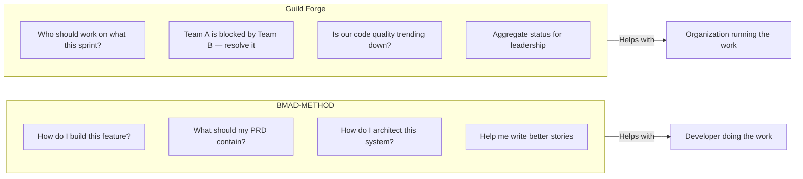
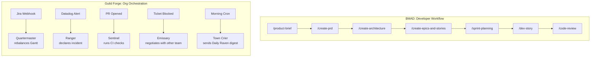
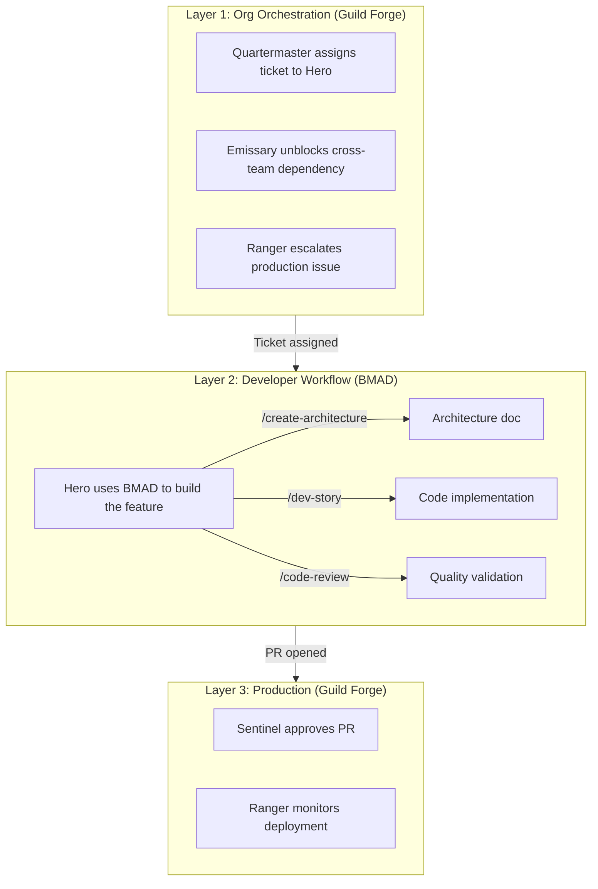

# Guild Forge vs BMAD-METHOD: Comparison Analysis

This analysis compares **Guild Forge** with **BMAD-METHOD** to determine overlap, differentiation, and whether the projects are redundant.

---

## Executive Summary

> [!IMPORTANT]
> **They are NOT redundant.** Guild Forge and BMAD-METHOD solve fundamentally different problems at different layers of the stack.

| Aspect | BMAD-METHOD | Guild Forge |
|:---|:---|:---|
| **Primary Focus** | **Development workflow guidance** — Helping developers build software | **Organizational orchestration** — Running a 40-person engineering org |
| **Target User** | Individual developer or small team | Engineering Director / Org leadership |
| **Scope** | Single project lifecycle | Multi-team, multi-project org |
| **Agent Purpose** | Guide humans through agile ceremonies | Automate operational overhead |
| **Metaphor** | Agile coach / pair programmer | Guild NPCs supporting human heroes |

---

## Real-World Analogies

### 🏭 The Factory Analogy

| Analogy | BMAD-METHOD | Guild Forge |
|:---|:---|:---|
| **What it is** | The **master craftsman** teaching you how to build a chair | The **factory floor manager** ensuring 10 production lines run smoothly |
| **Focus** | "Here's how to cut the wood, join the pieces, finish the surface" | "Line 3 is behind schedule, move 2 workers from Line 5" |
| **Output** | A well-crafted product | An efficient operation |

### 🏥 The Hospital Analogy

| Analogy | BMAD-METHOD | Guild Forge |
|:---|:---|:---|
| **What it is** | **Medical textbook + attending physician** guiding a resident through surgery | **Hospital operations center** managing beds, staff, and emergencies |
| **Focus** | "First, make the incision here, then..." | "ER is at 90% capacity, divert ambulances; Dr. Smith needs backup in OR 3" |
| **Output** | A successful surgery | A functioning hospital |

### 🎬 The Film Production Analogy

| Analogy | BMAD-METHOD | Guild Forge |
|:---|:---|:---|
| **What it is** | **Director's assistant** helping you storyboard, shoot, and edit a scene | **Production manager** coordinating 15 departments across a $100M film |
| **Focus** | "Try this camera angle, the lighting should be..." | "Costume dept is 2 days behind, delay the ballroom scene; catering for 200 on set B tomorrow" |
| **Output** | A great scene | A delivered film |

### 🏈 The Sports Analogy

| Analogy | BMAD-METHOD | Guild Forge |
|:---|:---|:---|
| **What it is** | **Position coach** teaching you to throw a better spiral | **General Manager** managing roster, trades, salary cap, and 5 coaching staffs |
| **Focus** | "Grip the ball like this, follow through..." | "Trade deadline approaching; injured reserve affecting cap space; Scout reports on draft prospects" |
| **Output** | A better player | A winning franchise |

### 🍳 The Restaurant Analogy

| Analogy | BMAD-METHOD | Guild Forge |
|:---|:---|:---|
| **What it is** | **Sous chef** guiding you through a complex recipe | **Restaurant group COO** running 12 locations, supply chain, and staffing |
| **Focus** | "Julienne the carrots, reduce the sauce by half..." | "Location 7 has a health inspection tomorrow; seafood supplier delayed; Manager quit at location 3" |
| **Output** | A delicious dish | A profitable restaurant chain |

---

## Where Each Excels (And Falls Short)

### BMAD is Superior When...
| Scenario | Why BMAD Wins |
|:---|:---|
| Solo developer building a startup MVP | Deep workflow guidance, IDE integration |
| Learning agile practices | Teaches methodology while you work |
| Small team, single codebase | Party mode, code review agents |
| Need help with PRDs, architecture docs | Generation, not just governance |

### Guild Forge is Superior When...
| Scenario | Why Guild Forge Wins |
|:---|:---|
| 40-person org with 5+ squads | Cross-team coordination, resource balancing |
| Production operations matter | Ranger, Investigator for incidents |
| Token/cost governance required | Mana Pool, rate limiting |
| Multiple external systems (Jira, Slack, Datadog) | Event-driven integrations |
| Human oversight is paramount | Override mechanisms, human supremacy principle |

---

### 1. What Problem Does Each Solve?

| BMAD-METHOD | Guild Forge |
|:---|:---|
| "Help me create a PRD" | "Track all PRDs across 5 teams" |
| "Guide me through architecture decisions" | "Enforce architectural standards across repos" |
| "Write stories for this feature" | "Balance sprint capacity across chapters" |
| "Review my code" | "Alert if code review cycle time spikes" |

### 2. Agent Roles Comparison

| BMAD Agents | Purpose | Guild Forge Agents | Purpose |
|:---|:---|:---|:---|
| **PM Agent** | Create product briefs, PRDs | **Quartermaster** | Track sprint velocity, Gantt charts |
| **Architect Agent** | Design systems | **Sage** | Review RFCs for architectural purity |
| **Developer Agent** | Implement stories | *(Humans do this)* | Heroes write code |
| **UX Agent** | Design interfaces | *(Not covered)* | N/A |
| **Scrum Master** | Facilitate ceremonies | **Grandmaster** | Cross-team resource allocation |
| **Code Review Agent** | Validate quality | **Sentinel** | CI/CD gatekeeper, burnout watch |
| *(Not covered)* | N/A | **Ranger** | Production monitoring, incident response |
| *(Not covered)* | N/A | **Emissary** | Cross-team dependency negotiation |
| *(Not covered)* | N/A | **Herald** | Team health, hiring needs |

### 3. Workflow vs Orchestration

**BMAD** is **sequential workflow** — human asks for help, agent guides them through a process.

**Guild Forge** is **event-driven orchestration** — system events trigger automated responses across an organization.

### 4. Infrastructure Layer

| Aspect | BMAD-METHOD | Guild Forge |
|:---|:---|:---|
| **Deployment** | CLI tool (`npx bmad-method install`) | Production services (Event Bus, Registry, etc.) |
| **State Management** | Project files (markdown artifacts) | PostgreSQL ledger, Redis, Git Codex |
| **Execution Model** | In-IDE (Claude Code, Cursor, Windsurf) | Serverless functions, background workers |
| **Token Management** | N/A (user's API key) | Org-wide Mana Pool with budgets per chapter |
| **Integrations** | IDE context | Jira, GitHub, Slack, Datadog, PagerDuty |

> [!NOTE]
> BMAD runs *inside* your development environment. Guild Forge runs *alongside* your organization's tooling.

---

## Where They Could Complement Each Other

**Potential Integration:**
1. **Guild Forge Quartermaster** assigns a Quest to a Hero
2. **Hero uses BMAD** to plan and build the feature
3. **Guild Forge Sentinel** validates and merges the PR
4. **Guild Forge Ranger** monitors production

---

## Strengths Comparison

### BMAD-METHOD Strengths
✅ **Developer experience** — Deeply integrated with IDE  
✅ **Agile best practices** — Structured workflows grounded in methodology  
✅ **Scale-adaptive** — Adjusts complexity to project size  
✅ **Learning tool** — Teaches agile practices while you work  
✅ **Party Mode** — Multi-agent collaboration in one session  
✅ **Extensive documentation** — 50+ workflows, tutorials  

### Guild Forge Strengths
✅ **Organizational scope** — Manages 40+ person orgs, not just projects  
✅ **Cross-team coordination** — Emissary handles dependencies between squads  
✅ **Production operations** — Ranger, Investigator handle incidents  
✅ **Resource governance** — Token budgets, rate limiting, mana pools  
✅ **Privacy architecture** — Transient data, GDPR compliance  
✅ **Human supremacy** — Override mechanisms, agents advise but don't decide  

---

## Gap Analysis

### What Guild Forge Has That BMAD Lacks
| Capability | Guild Forge | BMAD |
|:---|:---|:---|
| Cross-team dependency management | ✅ Emissary | ❌ |
| Production monitoring/incident response | ✅ Ranger | ❌ |
| Org-wide resource allocation | ✅ Grandmaster | ❌ |
| Token budget governance | ✅ Mana Pool | ❌ |
| Team health/burnout tracking | ✅ Herald, Sentinel | ❌ |
| Event-driven automation | ✅ Webhooks, cron | ❌ |

### What BMAD Has That Guild Forge Lacks
| Capability | BMAD | Guild Forge |
|:---|:---|:---|
| PRD/Product brief generation | ✅ PM Agent | ❌ |
| Architecture doc generation | ✅ Architect Agent | ❌ (Sage reviews, doesn't generate) |
| Story writing assistance | ✅ Dev Agent | ❌ |
| Code implementation guidance | ✅ Dev Agent | ❌ (Humans do this) |
| UX design workflows | ✅ UX Agent | ❌ |
| IDE integration | ✅ Native | ❌ |

---

## Conclusion

### Are They Redundant?

**No.** They operate at different levels:

| Layer | Tool | Function |
|:---|:---|:---|
| **Individual Developer** | BMAD-METHOD | "Help me build this feature well" |
| **Organization** | Guild Forge | "Help us run this engineering org well" |

### Recommendation

1. **Keep building Guild Forge** — It solves organizational orchestration problems that BMAD doesn't address
2. **Consider BMAD as complementary** — Heroes could use BMAD for their individual work while Guild Forge handles org-level coordination
3. **Potential future integration** — Guild Forge could detect when BMAD artifacts are created and use them for tracking

### The Analogy

> **BMAD** is like a senior engineer pair-programming with you.  
> **Guild Forge** is like having an entire support staff (TPM, SRE, Tech Writer, Program Manager) working in the background so engineers can focus on code.
