# Guild Forge vs Claude-Flow: Comparison Analysis

This analysis compares **Guild Forge** with **claude-flow** to evaluate: 
1. Whether claude-flow could serve as the infrastructure layer for a PoC
2. What gaps exist that Guild Forge uniquely addresses

---

## Executive Summary

> [!IMPORTANT]
> **claude-flow could serve as a PoC infrastructure layer**, but it's designed for a fundamentally different scope (development environment vs. organizational operations).

| Aspect | claude-flow | Guild Forge |
|:---|:---|:---|
| **Primary Focus** | Multi-agent AI development orchestration | Organization-wide operational orchestration |
| **Scope** | Single developer/project | 40-person org with multiple teams |
| **Runtime** | Local CLI / Claude Code MCP | Production services (Event Bus, Registry, Workers) |
| **Agents** | 60+ dev-focused (coder, tester, reviewer) | 10+ org-focused (Quartermaster, Ranger, Emissary) |
| **External Integrations** | GitHub PRs/Issues | Jira, Slack, Datadog, PagerDuty |
| **Token Management** | Per-session | Org-wide budgets, chapter quotas |

---

## Real-World Analogies

### 🏗️ The Construction Analogy

| Analogy | claude-flow | Guild Forge |
|:---|:---|:---|
| **What it is** | A **smart power tool** that helps you build faster | The **construction site manager** running 5 work crews |
| **Focus** | "Here's the best drill bit for this task, let me pre-set the torque" | "Crew 3 is behind, move 2 workers from Crew 5; lumber delivery delayed, reschedule foundation pour" |
| **Output** | Faster, higher-quality individual work | A project delivered on time |

### 🎮 The Gaming Analogy

| Analogy | claude-flow | Guild Forge |
|:---|:---|:---|
| **What it is** | **AI companions** fighting alongside your character | **Raid leader** coordinating 40 players across multiple guilds |
| **Focus** | "Spawning healer bot to support you; optimizing attack patterns" | "Guild A takes left flank, Guild B handles adds; loot distributed by DKP" |
| **Output** | Better individual gameplay | Successful raid completion |

### 🚗 The Automotive Analogy

| Analogy | claude-flow | Guild Forge |
|:---|:---|:---|
| **What it is** | **Driver-assist AI** in your car | **Fleet management system** for a 200-truck logistics company |
| **Focus** | "Lane assist active; optimizing route to destination" | "Truck 47 delayed, reroute package to Truck 23; driver hours compliance" |
| **Output** | Safer, more efficient driving | On-time delivery fleet-wide |

---

## Detailed Comparison

### 1. What Problem Does Each Solve?

### 2. Agent Roles Comparison

| claude-flow Agents | Purpose | Guild Forge Agents | Purpose |
|:---|:---|:---|:---|
| **coder** | Write code | *(Humans do this)* | Heroes write code |
| **tester** | Write tests | *(Humans do this)* | Heroes write tests |
| **reviewer** | Code review | **Sentinel** | CI gatekeeper, blocks bad PRs |
| **architect** | Design systems | **Sage** | Reviews RFCs for standards |
| **security** | Security audits | **Mason** | Infra security, cost monitoring |
| *(Not covered)* | N/A | **Quartermaster** | Sprint planning, Gantt charts |
| *(Not covered)* | N/A | **Ranger** | Production monitoring, incidents |
| *(Not covered)* | N/A | **Emissary** | Cross-team negotiation |
| *(Not covered)* | N/A | **Grandmaster** | Org-wide resource allocation |
| *(Not covered)* | N/A | **Herald** | Team health, hiring needs |

### 3. Infrastructure Comparison

| Component | claude-flow | Guild Forge | Can claude-flow substitute? |
|:---|:---|:---|:---|
| **Agent Execution** | ✅ Swarm orchestration | Serverless functions | ✅ **Yes** |
| **Agent Coordination** | ✅ Queen/worker, mesh, ring | Event-driven | ⚠️ **Partial** (different model) |
| **Memory/State** | ✅ AgentDB, HNSW | PostgreSQL, Redis | ✅ **Yes** |
| **Task Routing** | ✅ Q-learning router | Dispatcher + rules | ✅ **Yes** (actually better) |
| **MCP Integration** | ✅ 175+ tools | MCP for external APIs | ✅ **Yes** |
| **External Webhooks** | ❌ Not designed for this | ✅ Webhook Gateway | ❌ **No** |
| **Jira/Slack Integration** | ⚠️ GitHub only | ✅ Native connectors | ❌ **No** |
| **Token Budgets** | ❌ None | ✅ Mana Pool, quotas | ❌ **No** |
| **Cross-Team Coordination** | ❌ Single-project focus | ✅ Emissary, treaties | ❌ **No** |
| **Production Ops** | ❌ Not designed for this | ✅ Ranger, Investigator | ❌ **No** |
| **Human Override** | ⚠️ Claims system | ✅ `!guild override` | ⚠️ **Partial** |

---

## Using claude-flow for Guild Forge PoC

### What WOULD Work

```mermaid
flowchart TB
    subgraph Works["✅ claude-flow Can Handle"]
        A["Agent execution (swarms)"]
        B["Task routing (Q-learning)"]
        C["Memory/state (AgentDB)"]
        D["Learning from patterns"]
        E["MCP tool calls"]
    end
```

1. **Agent Execution** — claude-flow's swarm system could run Guild agents
2. **Task Routing** — Q-learning router is actually more sophisticated than our rules-based dispatcher
3. **Memory** — AgentDB + HNSW provides persistent agent memory
4. **Learning** — Self-optimizing patterns could improve agent performance over time

### What WOULDN'T Work (Gaps for PoC)

| Gap | Why It Matters | Workaround for PoC |
|:---|:---|:---|
| **No webhook gateway** | Can't receive Jira/Slack events | Manual triggers only |
| **Single-project scope** | No cross-team coordination | Single team PoC |
| **No production ops** | No Ranger/incident flow | Skip production monitoring |
| **No token governance** | Can't quota by chapter | Accept uncontrolled costs |
| **No cron scheduling** | No Daily Raven, scheduled jobs | Manual invocations |

---

## Recommendation: Hybrid Approach

### For PoC (Quick Validation)

**Use claude-flow for:**
- Agent execution runtime
- GitHub PR/Issue integration
- Task routing and learning

**Accept these limitations:**
- No Jira/Slack webhooks (trigger agents manually)
- Single team only (no Emissary)
- No production monitoring (no Ranger)
- No token budgets

### For Production (Full Vision)

**Keep from claude-flow:**
- Swarm coordination
- Q-learning routing  
- AgentDB memory
- Learning patterns

**Build custom:**
- Webhook Gateway (Jira, Slack, Datadog)
- Token Ledger (org-wide budgets)
- Notification Worker (Daily Raven throttling)
- Scheduler (cron for org-wide jobs)

---

## Final Verdict

| Question | Answer |
|:---|:---|
| **Is Guild Forge redundant with claude-flow?** | **No** — Different scope (org vs. project) |
| **Can claude-flow replace Guild Forge infrastructure?** | **Partially** — Good for agent runtime, lacks org-level features |
| **Recommended for PoC?** | **Yes** — Use claude-flow + accept limitations |
| **Recommended for production?** | **Hybrid** — claude-flow for runtime + custom ingress/governance |

### The Analogy

> **claude-flow** is a sophisticated workshop with smart power tools.  
> **Guild Forge** is the construction company running multiple job sites.

You could use claude-flow's workshop to build things faster, but you still need the construction company infrastructure to run multiple crews, handle client communications, and manage budgets across projects.

---

## Appendix: Feature Matrix (Post-Enhancement)

> [!NOTE]
> Guild Forge now includes [Enhanced Capabilities](../docs/infrastructure/enhanced_capabilities.md) and [Hero's Toolkit](../docs/heros_toolkit.md) that close previous gaps.

| Feature | claude-flow | Guild Forge (Enhanced) | Winner |
|:---|:---|:---|:---|
| Swarm execution | ✅ 60+ agents, swarms | ✅ Hierarchical, Mesh, Pipeline, Consensus | 🤝 Parity |
| Task routing | ✅ Q-learning, adaptive | ✅ Hybrid (Rules + Q-Learning + Load Balance) | 🤝 Parity |
| Multi-LLM support | ✅ Claude/GPT/Gemini/Ollama | ✅ Same + cost-aware routing | 🤝 Parity |
| Shared memory | ✅ AgentDB | ✅ Redis + PostgreSQL + Vector DB | 🤝 Parity |
| Learning patterns | ✅ SONA | ✅ Routing feedback + pattern storage | 🤝 Parity |
| **Developer experience** | ✅ Dev-focused agents | ✅ Squire, Weaponsmith, Mentor | 🤝 Parity |
| External webhooks | ❌ | ✅ Jira, Slack, Datadog | 🏆 Guild Forge |
| Token governance | ❌ | ✅ Mana Pool, quotas | 🏆 Guild Forge |
| Cross-team coordination | ❌ | ✅ Emissary, treaties | 🏆 Guild Forge |
| Production ops | ❌ | ✅ Ranger, Investigator | 🏆 Guild Forge |
| Human override | ⚠️ Claims | ✅ `!guild override` | 🏆 Guild Forge |
| Scheduled jobs | ❌ | ✅ Cron scheduler | 🏆 Guild Forge |
| **Bottom-up feedback** | ❌ | ✅ Hero negotiation, ratings | 🏆 Guild Forge |

### Summary
- **6 features at parity** (execution, routing, LLM, memory, learning, dev experience)
- **7 features where Guild Forge wins** (webhooks, governance, cross-team, ops, override, scheduling, feedback)
- **0 features where claude-flow wins**

With enhanced capabilities, Guild Forge now matches claude-flow's strengths while adding organizational orchestration that claude-flow doesn't address.
